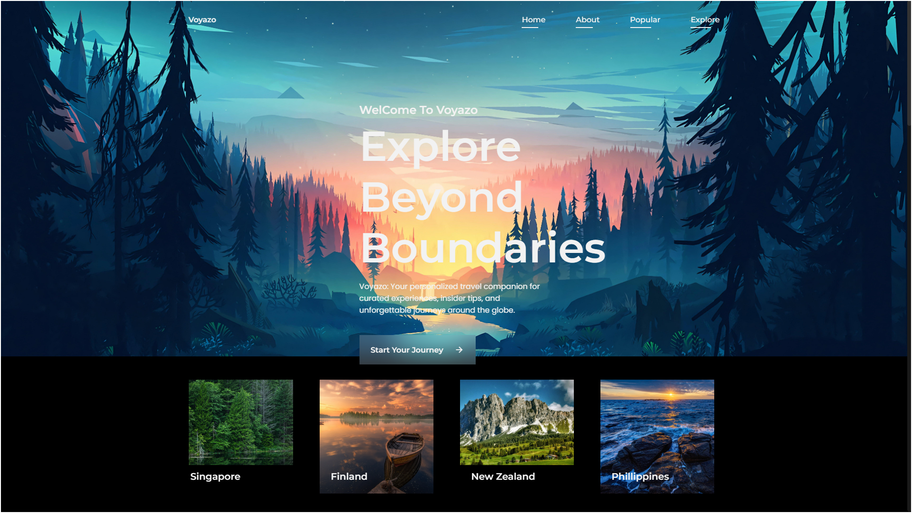

**Voyazo - A Responsive Travel Website**
=====================================

**Description**
---------------

Voyazo is a modern and clean travel website built using HTML, CSS, and JavaScript. This project is perfect for travel enthusiasts and adventure-seekers, with a fully responsive design that ensures a seamless user experience across various devices and screen sizes.

**Features**
------------

• **Responsive Design**: Enjoy a smooth user experience on desktop, tablet, and mobile devices.
• **Modern Design**: Clean and travel-related elements come together to create a beautiful website.
• **Built with HTML, CSS, and JavaScript**: Fast and efficient performance guaranteed.
• **Easy Navigation**: Explore different sections of the website with ease.

**Technologies Used**
--------------------

• **HTML5**: The latest HTML standard for building web applications.
• **CSS3**: The latest CSS standard for styling and layout.
• **JavaScript**: For adding interactivity to the website.
• **Responsive Web Design (RWD)**: Ensures a seamless user experience across devices.

**Screenshots**
--------------

**Getting Started**
------------------

1. **Clone the Repository**: `git clone https://github.com/prateekrager/Voyazo-Travel-Website.git`
2. **Open in Code Editor**: Open the project in your preferred code editor or IDE.
3. **Run the Website**: Open the `index.html` file in a web browser.

**File Structure**
-----------------

* `index.html`: The main entry point of the website.
* `css/`: Folder containing CSS files for styling.
	+ `style.css`: Main stylesheet for the website.
* `scripts/`: Folder containing JavaScript files for interactivity.
	+ `main.js`: Main JavaScript file for the website.
	+ `scrollreveal.min.js`: JavaScript library for animations.
* `img/`: Folder containing images used in the website.

**License**
---------

This project is licensed under the MIT License. See the [LICENSE](LICENSE) file for details.
